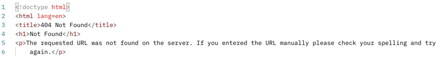

# Delphi Flask API Take-home

## Dataset

[Cheese Scores](https://www.kaggle.com/datasets/ericsims/world-cheese-awards-worlds-cheesiest-dataset?resource=download)

    ID BIGINT PRIMARY KEY,
    COMPANY VARCHAR(128),
    PRODUCT_NAME VARCHAR(128),
    RATING VARCHAR(128),
    CATEGORY VARCHAR(256),
    COUNTRY VARCHAR(128),
    COUNTY VARCHAR(128)

## Start the Database Container

Start the database with the following command:

    docker run --rm -p 3306:3306 -e MYSQL_ROOT_PASSWORD=strong_password -e MYSQL_DATABASE=delphi -e MYSQL_USER=foo -e MYSQL_PASSWORD=bar -v $(pwd)/database/init/:/run/init -v $(pwd)/database/my.cnf:/etc/mysql/my.cnf --name cheese_database mysql:latest

In a separate terminal, run the following command to populate the database.

    docker exec cheese_database /bin/sh -c 'chmod +x /run/init/initialize_database.sh && ./run/init/initialize_database.sh'

## Start the API

Install the dependencies (preferably within a new Python3 virtual environment)

    pip3 install -r requirements.txt

Start the API

    python3 api/main.py

## List of endpoints

 - `/cheese/` - return list of all records
   - Request example: `curl --location --request GET 'http://127.0.0.1:5000/cheese'`
   - Response: 
 - `/cheese/<id:int>` - return the cheese of a given ID. If that ID does not exist, return a 404.
    - Request example: `curl --location --request GET 'http://127.0.0.1:5000/cheese/1'`
    - Response if given ID exists: 
    - Response if given ID does not exist: 
 - `/cheese/<country>` - return all the cheeses within a given country
   - Request example: `curl --location --request GET 'http://127.0.0.1:5000/cheese/Spain'`
   - Response: 
 - `/cheese/countries` - return a unique list of all countries available in the database
   - Request example: `curl --location --request GET 'http://127.0.0.1:5000/cheese/countries'`
   - Response: 
 - `/cheese/country_scores` - return the number of gold, bronze, silver and super gold awarded cheeses per country
   - Request example: `curl --location --request GET 'http://127.0.0.1:5000/cheese/country_scores'` 
   - Response: 
 
